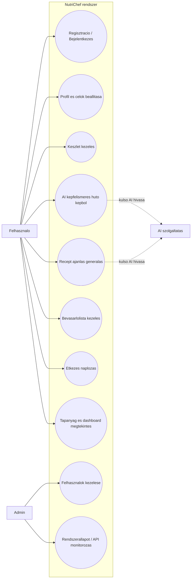

# 🍳 NutriChef

> Okos élelmiszer-nyilvántartás AI-alapú recept ajánlásokkal és tápanyag-követéssel

NutriChef egy modern, full-stack webalkalmazás, amely segít nyomon követni az élelmiszereket, generálni személyre szabott recept ajánlásokat, és kezelni a táplálkozási szükségleteket. Fejlett AI integráció, valós idejű szinkronizálás és intuitív felhasználói felület jellemzi.

## ✨ Főbb Funkciók

### 🏠 **Okos Élelmiszer Nyilvántartás**

- **AI-alapú képfelismerés**: Töltsd fel a hűtő/kamra képét, az AI automatikusan felismeri az élelmiszereket
- **Manuális hozzáadás**: Gyorsan adj hozzá tételeket részletes információkkal (mennyiség, egység, lejárat, hely)
- **Hely alapú szervezés**: Rendszerezés hűtő, kamra, fagyasztó szerint
- **Lejárati értesítések**: Emlékeztetők a közelgő lejárati dátumokról
- **Készletkezelés**: Valós idejű készlet nyomon követés fogyasztási arányokkal

### 🤖 **AI-alapú Recept Ajánlások**

- **Intelligens megfeleltetés**: Receptek generálása a meglévő hozzávalók alapján
- **Kétféle mód**:
  - 📦 **Hűtő mód**: Automatikus ajánlások a nyilvántartásból
  - ✏️ **Egyéni mód**: Adj meg saját hozzávalókat
- **Testreszabható szűrők**:
  - Adagok száma (1-12 fő)
  - Minimum egyezési százalék (50-100%)
  - Allergiák és kerülendő ételek
- **Részletes recept információk**:
  - Lépésről-lépésre utasítások
  - Tápanyag-lebontás (kalória, fehérje, szénhidrát, zsír)
  - Előkészítési és főzési idő
  - Nehézségi szint
  - Konyha típusa
- **Recept mentés**: Mentsd el kedvenc receptjeidet
- **Bevásárlólista export**: Hiányzó hozzávalók hozzáadása egyetlen kattintással

### 📋 **Okos Bevásárlólista**

- **Recept integráció**: Automatikus akkordeon nézet recept hozzávalókkal
- **Kategorizálás**: Automatikus csoportosítás (zöldség, hús, tejtermékek, stb.)
- **Készlet jelzés**: Kiemeli a már meglevő tételeket
- **Adag módosítás**: Dinamikus mennyiség-skálázás személyek számához
- **Adag optimalizálás**: Kerekítés szabványos csomagméretekhez
- **Export funkció**: Lista exportálás szövegfájlba
- **Gyorsbillentyűk**:
  - `Ctrl+A`: Fókusz a tétel hozzáadásra
  - `Ctrl+E`: Lista exportálás
  - `Delete`: Befejezett tételek törlése

### 🍽️ **Étkezés Naplózás & Tápanyag Követés**

- **Többféle beviteli mód**:
  - 📝 Manuális bevitel kalória auto-számítással
  - 📦 Választás nyilvántartásból
  - 📖 Választás mentett receptekből
- **Naponta nyomon követett makrók**:
  - Kalória, fehérje, szénhidrát, zsír, rost
  - Vizuális folyamatjelzők
  - Cél vs. tényleges összehasonlítás
- **Étkezés típusok**: Reggeli, ebéd, vacsora, snack
- **Vizuális elemzések**: Grafikonok napi és heti tendenciákhoz
- **Célbeállítások**: Egyedi kalória és makró célok

### 👤 **Felhasználói Profil & Beállítások**

- **BMR számítás**: Automatikus alapanyagcsere számítás
- **Testméretek követés**: Súly, magasság, életkor
- **Aktivitási szint**: Testreszabható alapján
- **Diétás preferenciák**: Allergiák, étkezési korlátozások
- **Két nyelv**: Magyar és angol
- **Sötét/világos mód**: Szem-kímélő témák
- **Fiók kezelés**: Biztonságos bejelentkezés és munkamenet kezelés

### 📊 **Irányítópult & Elemzések**

- **Napi áttekintés**: Összefoglaló kártyák napi célokhoz
- **Készlet statisztikák**: Teljes tételek, lejáró termékek
- **Gyors műveletek**: Gyakori feladatok elérése
- **Heti összefoglaló**: Táplálkozási tendenciák idővel

## 🛠️ Technológiai Stack

### Frontend

- **React 18** + **TypeScript**: Type-safe UI fejlesztés
- **Vite**: Villámgyors build eszköz
- **Tailwind CSS**: Utility-first styling
- **Lucide Icons**: Modern ikon könyvtár
- **Redux Toolkit**: Állapotkezelés
- **React Router**: Navigáció
- **i18next**: Nemzetköziesítés (hu/en)
- **GSAP**: Sima animációk
- **Sonner**: Elegáns értesítések
- **Axios**: HTTP kliens

### Backend

- **Node.js** + **Express**: REST API
- **TypeScript**: Type-safe backend kód
- **Prisma ORM**: Adatbázis kezelés
- **PostgreSQL**: Relációs adatbázis
- **JWT**: Biztonságos authentikáció
- **Bcrypt**: Jelszó hashelés
- **Express Validator**: Input validálás
- **Rate Limiting**: API védelem

### AI Integráció

- **Google Gemini API**: Recept generálás és képfelismerés
- **OpenAI GPT-4** (opcionális): Alternatív AI szolgáltató
- **Intelligens prompt engineering**: Kontextus-tudatos AI válaszok
- **Eredmény gyorsítótárazás**: Token optimalizálás

## 📁 Projekt Struktúra

```
NutriChef/
├── frontend/                 # React alkalmazás
│   ├── src/
│   │   ├── components/      # Újrafelhasználható komponensek
│   │   │   ├── ui/         # Alap UI komponensek
│   │   │   └── inventory/  # Nyilvántartás-specifikus
│   │   ├── pages/          # Oldal komponensek
│   │   ├── services/       # API szolgáltatások
│   │   ├── store/          # Redux store
│   │   ├── hooks/          # Custom React hooks
│   │   ├── context/        # React context providers
│   │   ├── i18n/           # Fordítási fájlok
│   │   ├── types/          # TypeScript típusok
│   │   └── utils/          # Segédfüggvények
│   └── public/             # Statikus eszközök
│
├── backend/                 # Express API
│   ├── src/
│   │   ├── controllers/    # Request kezelők
│   │   ├── routes/         # API útvonalak
│   │   ├── services/       # Üzleti logika
│   │   ├── middlewares/    # Custom middleware-ek
│   │   ├── config/         # Konfiguráció
│   │   └── utils/          # Backend segédfüggvények
│   ├── prisma/
│   │   ├── schema.prisma   # Adatbázis séma
│   │   ├── seed.ts         # Adatbázis seed
│   │   └── migrations/     # DB migrációk
│   └── uploads/            # Feltöltött fájlok
│
└── docs/                    # Dokumentáció
```

## 🚀 Telepítés és Futtatás

### Előfeltételek

- Node.js 18+
- PostgreSQL 14+
- npm 9+
- Google Gemini API kulcs (vagy OpenAI API kulcs)

### Gyorsindítás (lokális fejlesztés)

Leggyorsabb opcio (mindent intez egy parancs):

```bash
npm run dev:easy
```

Ez telepiti a csomagokat, lefuttatja a migraciot + seedet, majd elinditja a frontendet es a backendet.

```bash
git clone https://github.com/AFekexd/NutriChef.git
cd NutriChef

# 1) Minden dependency telepítése (root + backend + frontend)
npm run install:all

# 2) .env fájlok létrehozása (PowerShell)
Copy-Item .env.example .env
Copy-Item backend/.env.example backend/.env
Copy-Item frontend/.env.example frontend/.env

# 3) Adatbázis migráció + seed
cd backend
npx prisma migrate dev
npm run seed
cd ..

# 4) Frontend + backend indítása egy paranccsal
npm run dev
```

### Minimálisan szükséges `.env` beállítások fejlesztéshez

#### `backend/.env`

```dotenv
DATABASE_URL="postgresql://<user>:<password>@localhost:5432/nutrichef?schema=public"
PORT=5000
NODE_ENV=development
JWT_SECRET="dev-secret"
JWT_REFRESH_SECRET="dev-refresh-secret"
GEMINI_API_KEY="your_gemini_key"
CLIENT_ENCRYPTION_KEY="same-32-char-key-as-frontend"
```

#### `frontend/.env`

```dotenv
VITE_API_URL=http://localhost:5000/api
VITE_ENCRYPTION_KEY=same-32-char-key-as-backend
```

> Fontos: a `CLIENT_ENCRYPTION_KEY` (backend) és a `VITE_ENCRYPTION_KEY` (frontend) értéke egyezzen meg.

### Alternatív parancsok

- Csak backend: `npm run dev:backend`
- Csak frontend: `npm run dev:frontend`
- Build ellenőrzés: `npm run build:check`

### Alkalmazás elérése

- Frontend: http://localhost:5173
- Backend API: http://localhost:5000/api
- Swagger Docs: http://localhost:5000/api-docs

## 📖 API Dokumentáció

A backend Swagger UI-t biztosít az API felfedezéséhez:

```
http://localhost:5000/api-docs
```

### Főbb Végpontok

#### **Authentikáció**

- `POST /api/auth/register` - Új felhasználó regisztráció
- `POST /api/auth/login` - Felhasználó bejelentkezés
- `POST /api/auth/logout` - Felhasználó kijelentkezés
- `GET /api/auth/me` - Aktuális felhasználó lekérése

#### **Nyilvántartás**

- `GET /api/inventory` - Összes nyilvántartási tétel
- `POST /api/inventory` - Új tétel hozzáadása
- `PUT /api/inventory/:id` - Tétel frissítése
- `DELETE /api/inventory/:id` - Tétel törlése

#### **AI Funkciók**

- `POST /api/inventory/ai/detect` - Kép feltöltés AI felismeréshez
- `POST /api/recipes/recommendations` - AI recept ajánlások

#### **Receptek**

- `GET /api/recipes` - Felhasználó receptjei
- `POST /api/recipes` - Új recept létrehozása
- `DELETE /api/recipes/:id` - Recept törlése

#### **Tápanyag Követés**

- `GET /api/nutrition/daily` - Napi tápanyag összefoglaló
- `POST /api/nutrition/meals` - Étkezés naplózás
- `GET /api/nutrition/weekly` - Heti összesítések

## 🎨 Képernyőképek

## 🧩 Esetdiagram (Use Case)

Az alabbi Mermaid diagram egy gyakorlati esetdiagram a NutriChef fo felhasznaloi es admin folyamataihoz.



Tipp: ha klasszikus UML stilusban kell beadni, ezt a logikat at tudod vinni Draw.io vagy StarUML diagramra ugyanilyen actor + use case kapcsolatokkal.

### Főbb Képernyők

1. **Irányítópult**: Napi áttekintés és gyors műveletek
2. **Okos Nyilvántartás**: AI képfelismerés és készletkezelés
3. **AI Recept Ajánlások**: Kétféle mód (Hűtő/Egyéni)
4. **Bevásárlólista**: Recept accordionok és adag módosítás
5. **Tápanyag Követés**: Napi naplózás és makró követés
6. **Profil & Beállítások**: Testreszabás és preferenciák

## 🔐 Biztonság

- **JWT Authentikáció**: Biztonságos munkamenet kezelés
- **Bcrypt Hashelés**: Jelszavak biztonságos tárolása
- **Rate Limiting**: API visszaélés védelem
- **Input Validálás**: Minden felhasználói input validálva
- **CORS Konfiguráció**: Engedélyezett originek
- **Kétrétegű védelem API kulcsokhoz**:
  - **Client-Side**: HTTPS + kliensoldali titkosítás/obfuszkáció (a frontendbe épített kulcs nem tekinthető teljes értékű titoknak)
  - **Server-Side**: AES-256-GCM titkosítás adatbázisban (ENCRYPTION_MASTER_KEY)
- **Environment Variables**: Érzékeny adatok védve

> 📖 **Részletes titkosítási útmutató**: Lásd [ENCRYPTION_SETUP.md](ENCRYPTION_SETUP.md)

## 🌍 Nemzetköziesítés

Az alkalmazás két nyelvet támogat:

- 🇭🇺 **Magyar** (alapértelmezett)
- 🇬🇧 **Angol**

A nyelvek között a felhasználói beállításokban lehet váltani.

## 📎 Elektronikus mellékletek és alátámasztó dokumentumok

A szakdolgozati bírálathoz szükséges alátámasztó anyagok listája és státusza a következő fájlban található:

- [docs/thesis/README.md](docs/thesis/README.md)

Javasolt leadási csomag elemek:

- Teljes forráskód + futtatási útmutató
- MVP brief
- Piaci/kapcsolódó rendszerek elemzése
- Követelményjegyzék (funkcionális + nem-funkcionális)
- Use case lista
- GUI/UX képernyőspecifikáció (reszponzív nézetekkel)
- Architektúra + ADR
- Adatmodell + ER diagram
- API/modul interfészek
- Biztonsági minimum
- Tesztelési terv + validációs jegyzőkönyv
- MI-használati nyilatkozat + napló
- Reprodukciós README

## 🤝 Közreműködés

Közreműködéseket szívesen fogadunk! Kérlek:

1. Forkold a repositoryt
2. Hozz létre egy feature branch-et (`git checkout -b feature/AmazingFeature`)
3. Commitold a változtatásokat (`git commit -m 'Add some AmazingFeature'`)
4. Pushold a branch-re (`git push origin feature/AmazingFeature`)
5. Nyiss egy Pull Request-et

## 📝 Licensz

Ez a projekt MIT licensz alatt van - lásd a [LICENSE](LICENSE) fájlt részletekért.

## 👨‍💻 Fejlesztő

**AFekexd**

- GitHub: [@AFekexd](https://github.com/AFekexd)

## 🙏 Köszönetnyilvánítás

- Google Gemini AI a recept generálásért és képfelismerésért
- Shadcn/ui a gyönyörű UI komponensekért
- A nyílt forráskódú közösségnek az eszközökért és könyvtárakért

---

**NutriChef** - Okos főzés AI-val 🍳✨
